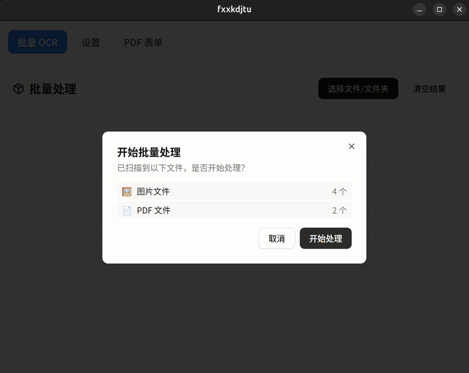
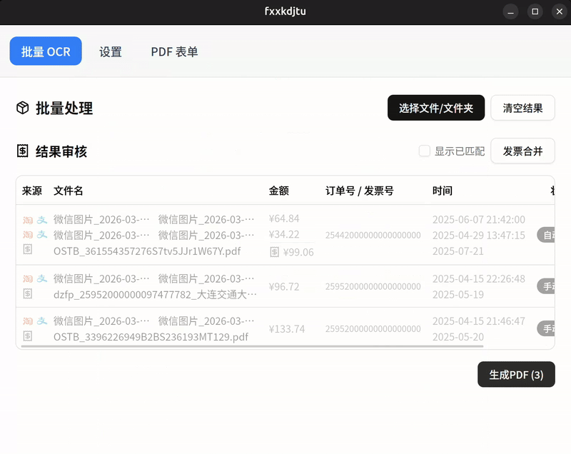

<h1 align="center">
  
  <br>
  fxxkdjtu
  <br>
</h1>

<h3 align="center">
A fxxkDJTU GUI based on <a href="https://github.com/tauri-apps/tauri">Tauri</a>.
</h3>

## Preview

| Identify                             | Generate                             |
| -------------------------------- | --------------------------------- |
|  |  |

## Install

请到发布页面下载对应的安装包：[Release page](https://github.com/roweiku/fxxkDJTU/releases)<br>
Go to the [Release page](https://github.com/roweiku/fxxkDJTU/releases) to download the corresponding installation package.

### 支持平台

| 平台 | 架构 | 格式 | 说明 |
|------|------|------|------|
| Windows | x64 | `.exe` (NSIS) | 标准版 |
| Linux | x64 | `.deb` | Debian/Ubuntu |
| Linux | x64 | `.AppImage` | 通用 Linux（支持自动更新） |

## Features

- 基于性能强劲的 Rust 和 Tauri 2 框架
- 内置 OCR 引擎，支持切换模型，最快单张0.1s起。
- 简洁美观的用户界面，支持自定义主题颜色。
- 统一用户输入，支持打包一键上传所有待贴发票和支撑材料。
- 可视化结果审核，支持手动修改、合并和冲突解决。
- 基于 [PDFme](https://github.com/pdfme/pdfme) 的PDF生成器，支持预览、二次编辑、导出、自定义模板，自动填充生成规范报销文档。


### FAQ

Refer to [Doc FAQ Page](xxx)

## Development

See [CONTRIBUTING.md](./CONTRIBUTING.md) for more details.

To run the development server, execute the following commands after all prerequisites for **Tauri** are installed:

```shell
pnpm i
pnpm tauri dev
```

## CI/CD

项目使用 GitHub Actions 自动化构建和发布，详见 [docs/CICD.md](./docs/CICD.md)。

### 发布流程

1. 更新 `Changelog.md`，在顶部添加新版本条目
2. 同步更新 `package.json`、`src-tauri/tauri.conf.json`、`src-tauri/Cargo.toml` 中的版本号
3. 提交并推送到 `main` 分支
4. 创建并推送 tag：`git tag v0.x.x && git push origin v0.x.x`
5. Release workflow 自动构建 2 个平台（Win x64 + Linux x64）并创建 GitHub Release

## Contributions

Issue and PR welcome!

## Acknowledgement

fxxkdjtu was based on or inspired by these projects and so on:

- [tauri-apps/tauri](https://github.com/tauri-apps/tauri): Build smaller, faster, and more secure desktop applications with a web frontend.
- [pdfme/pdfme](https://github.com/pdfme/pdfme): PDF generation library with template designer.
- [houqp/readability](https://github.com/houqp/readability): Rust library for OCR (ocr-rs).
- [jrmuizel/pdf-extract](https://github.com/jrmuizel/pdf-extract): A Rust library for extracting content from PDFs.
- [shadcn-vue/shadcn-vue](https://github.com/shadcn-vue/shadcn-vue): High-quality Vue components built on Radix UI and Tailwind CSS.
- [vitejs/vite](https://github.com/vitejs/vite): Next generation frontend tooling. It's fast!

## License

~~GPL-3.0 License. See [License here](./LICENSE) for details.~~
